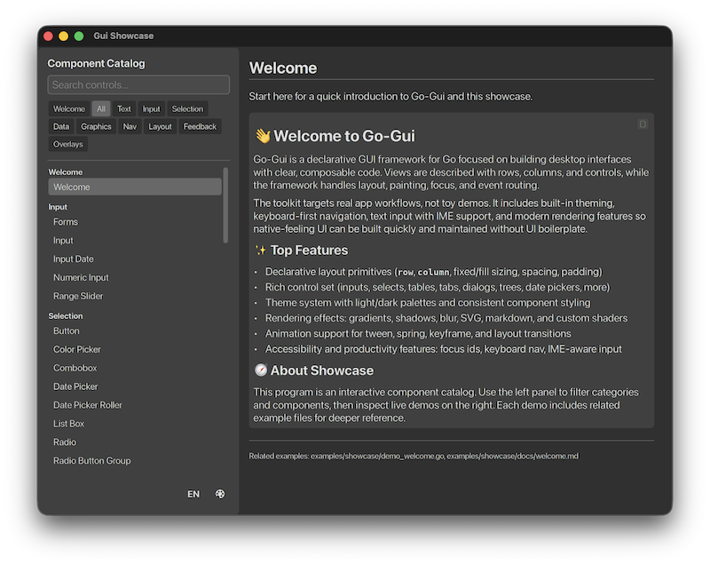
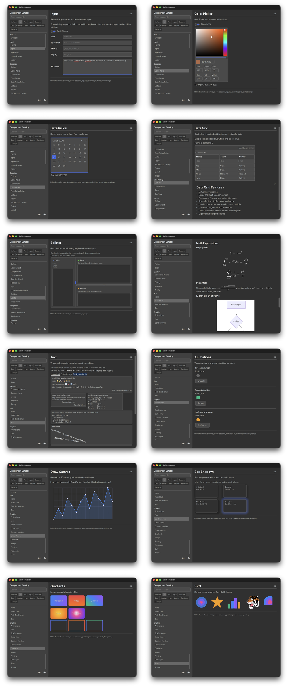
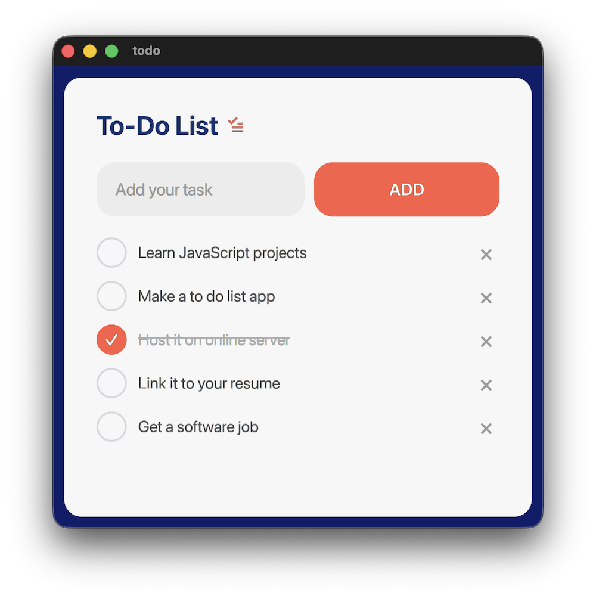
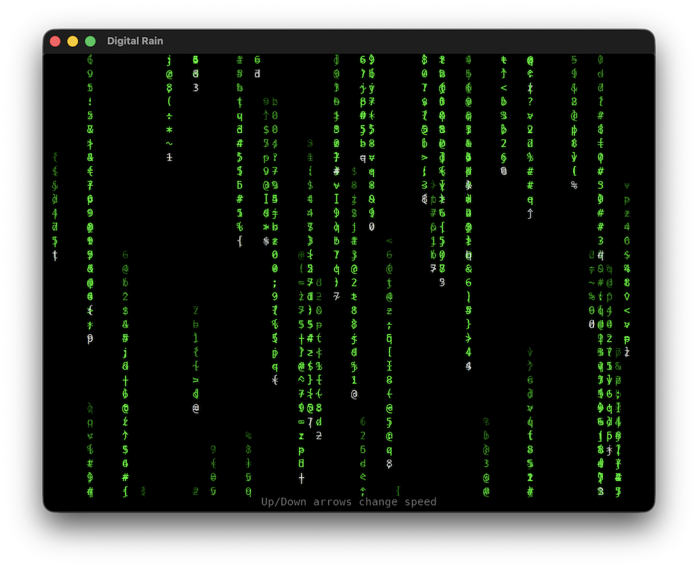
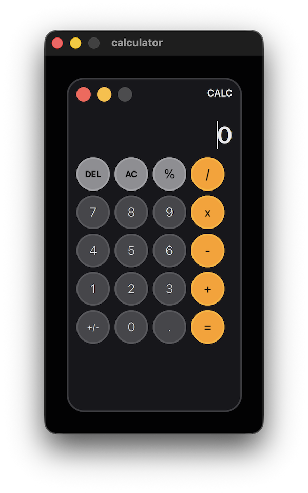

# Go-Gui


[](https://deepwiki.com/mike-ward/go-gui)

**Cross-platform, immediate-mode GUI framework for Go — no virtual DOM,
no diffing, just fast, composable UI.**



---

## 📋 About

Go-Gui is an immediate-mode GUI framework where every frame, a plain Go
function returns a layout tree that gets sized, positioned, and rendered
directly to the screen. State lives in a single typed slot per window —
no globals, no closures, no hidden magic.

Originally ported from the
[V-language gui library](https://github.com/mike-ward/gui), Go-Gui keeps
the same philosophy: minimal ceremony, composable widgets, and a clean
separation between layout logic and rendering.

```
View fn → Layout tree → layoutArrange() → renderLayout() → []RenderCmd → GPU
```

---

## ✨ Features

**Widgets & Layout**
- 50+ built-in widgets — buttons, inputs, sliders, tables, trees, tabs,
  menus, dialogs, toasts, breadcrumbs, and more
- Flexible layout system — Row, Column, Wrap, Canvas, Splitter, DockLayout,
  ExpandPanel, OverflowPanel, RotatedBox
- DataGrid with virtualization, sorting, grouping, inline editing,
  CSV/TSV/XLSX/PDF export, and async data sources
- Dock layout with drag-and-drop panel rearrangement and tab groups

**Rendering & Backends**
- GPU-accelerated rendering via SDL2 + Metal (macOS) / OpenGL (Linux/Windows)
- Web/WASM backend — Canvas2D with custom WebGL shaders, runs in any browser
- iOS backend — Metal rendering, UIKit windowing, touch events
- Android backend support
- Custom GPU shader support

**Text & Rich Content**
- Rich text input — multiline, click-to-cursor, drag-to-select, word select,
  autoscroll, Home/End cycling
- Markdown and RTF views with syntax highlighting and code-block
  copy-to-clipboard
- Text selection and copy for read-only Text widgets
- SVG loading, caching, and tessellation
- Powered by [go-glyph](https://github.com/mike-ward/go-glyph) for
  professional-grade text shaping, rendering, and bidirectional layout

**Animation & Effects**
- Full animation subsystem — keyframe, spring, tween, hero transitions
- ColorFilter post-processing — grayscale, sepia, brightness, contrast,
  hue rotate, invert, saturation, and composable filter chains
- ClipContents — stencil-based rounded-rect clip masking
- Box shadows and blur effects

**Input & Interaction**
- Touch gesture recognition — tap, double-tap, long-press, pan, swipe,
  pinch, rotate with automatic mouse-event synthesis for compatibility
- Pan gestures auto-scroll containers; pinch/rotate available on
  ContainerCfg and DrawCanvasCfg

**Audio**
- Opt-in audio via SDL_mixer — sound effects and music playback
- Multiple mixing channels, volume control, fade in/out
- Load from file or embedded bytes (WAV, OGG, MP3, FLAC, MOD)

**Platform Integration**
- Windows backend — native file dialogs, print, and notifications
- OS-level spell check (macOS NSSpellChecker, Linux Hunspell)
- IME support and accessibility tree (macOS, Linux AT-SPI2)
- Multi-window support with cross-window messaging
- Native dialogs, notifications, system tray, and print/PDF
- Native menu bar support
- Locale and i18n support
- Command registry with global hotkeys and fuzzy-search command palette

**Developer Experience**
- Theme system with built-in dark/light variants and custom themes
- Stateless view model — views are pure functions, easy to test
- Headless test backend runs all layout and widget logic without a display
- Embedded Feather icon font with themed styles
- Time-travel debugging — opt-in `WindowCfg.DebugTimeTravel` auto-spawns a
  scrubber window that rewinds/replays app state frame-by-frame



---

## 🚀 Quick Start

```go
package main

import (
    "fmt"

    "github.com/mike-ward/go-gui/gui"
    "github.com/mike-ward/go-gui/gui/backend"
)

type App struct{ Clicks int }

func main() {
    gui.SetTheme(gui.ThemeDarkBordered)

    w := gui.NewWindow(gui.WindowCfg{
        State:  &App{},
        Title:  "get_started",
        Width:  300,
        Height: 300,
        OnInit: func(w *gui.Window) { w.UpdateView(mainView) },
    })

    backend.Run(w)
}

func mainView(w *gui.Window) gui.View {
    ww, wh := w.WindowSize()
    app := gui.State[App](w)

    return gui.Column(gui.ContainerCfg{
        Width:  float32(ww),
        Height: float32(wh),
        Sizing: gui.FixedFixed,
        HAlign: gui.HAlignCenter,
        VAlign: gui.VAlignMiddle,
        Content: []gui.View{
            gui.Text(gui.TextCfg{
                Text:      "Hello GUI!",
                TextStyle: gui.CurrentTheme().B1,
            }),
            gui.Button(gui.ButtonCfg{
                IDFocus: 1,
                Content: []gui.View{
                    gui.Text(gui.TextCfg{
                        Text: fmt.Sprintf("%d Clicks", app.Clicks),
                    }),
                },
                OnClick: func(_ *gui.Layout, e *gui.Event, w *gui.Window) {
                    gui.State[App](w).Clicks++
                    e.IsHandled = true
                },
            }),
        },
    })
}
```

See [`examples/get_started/`](examples/get_started/) for the full runnable
version and [`examples/web_demo/`](examples/web_demo/) for the browser build.

---

## 📦 Installation

### Prerequisites

Go-Gui requires **Go 1.26+** and SDL2 development libraries.

#### macOS (Homebrew)

```bash
brew install go pkg-config sdl2 sdl2_mixer freetype harfbuzz pango fontconfig
```

#### Ubuntu / Debian

```bash
sudo apt-get update
sudo apt-get install -y \
  golang build-essential pkg-config \
  libsdl2-dev libsdl2-mixer-dev libfreetype6-dev libharfbuzz-dev \
  libpango1.0-dev libfontconfig1-dev
```

#### Fedora / RHEL

```bash
sudo dnf install -y golang gcc pkgconf-pkg-config \
  SDL2-devel SDL2_mixer-devel freetype-devel harfbuzz-devel pango-devel fontconfig-devel
```

#### Arch Linux

```bash
sudo pacman -Syu --noconfirm go base-devel pkgconf \
  sdl2 sdl2_mixer freetype2 harfbuzz pango fontconfig
```

#### Windows (MSYS2 MinGW x64)

```bash
pacman -S --needed mingw-w64-x86_64-go mingw-w64-x86_64-gcc \
  mingw-w64-x86_64-pkgconf mingw-w64-x86_64-SDL2 \
  mingw-w64-x86_64-SDL2_mixer mingw-w64-x86_64-freetype \
  mingw-w64-x86_64-harfbuzz mingw-w64-x86_64-pango \
  mingw-w64-x86_64-fontconfig
```

Use the `MSYS2 MinGW x64` shell for `go build` / `go run`.

#### Windows (vcpkg)

```bash
vcpkg install sdl2:x64-windows sdl2-mixer:x64-windows \
  freetype:x64-windows harfbuzz:x64-windows pango:x64-windows \
  fontconfig:x64-windows
```

Set `CGO_CFLAGS` and `CGO_LDFLAGS` to the vcpkg include/lib paths before
building.

### Get the Module

```bash
go get github.com/mike-ward/go-gui
```



---

## ⚙️ Configuration

### Backend Selection

`backend.Run(w)` auto-selects Metal on macOS and OpenGL elsewhere:

```go
import "github.com/mike-ward/go-gui/gui/backend"

backend.Run(w) // Metal on macOS, GL on Linux/Windows
```

To force a specific backend, import it directly:

```go
import metal "github.com/mike-ward/go-gui/gui/backend/metal" // macOS only
import gl    "github.com/mike-ward/go-gui/gui/backend/gl"    // cross-platform
import sdl2  "github.com/mike-ward/go-gui/gui/backend/sdl2"  // software fallback
import web   "github.com/mike-ward/go-gui/gui/backend/web"   // WASM/browser
import ios   "github.com/mike-ward/go-gui/gui/backend/ios"   // iOS
```

### Themes

```go
gui.SetTheme(gui.ThemeDark)          // set globally before NewWindow
gui.SetTheme(gui.ThemeDarkBordered)  // dark with visible borders
t := gui.CurrentTheme()              // read anywhere
```

Custom themes are built with `gui.ThemeMaker` and registered via
`gui.RegisterTheme`.

### Multi-Window

```go
app := gui.NewApp()
app.ExitMode = gui.ExitOnMainClose

w1 := gui.NewWindow(gui.WindowCfg{State: &Main{}, Title: "Main"})
w2 := gui.NewWindow(gui.WindowCfg{State: &Inspector{}, Title: "Inspector"})

backend.RunApp(app, w1, w2)
```

Open windows at runtime with `app.OpenWindow(cfg)`. Communicate across
windows with `app.Broadcast(fn)` or `other.QueueCommand(fn)`.

### Time-Travel Debugging

Opt-in with one flag. Implement `Snapshotter` on your state, set
`DebugTimeTravel: true`, and a scrubber window spawns alongside the app.

```go
type App struct { Count int }

func (s *App) Snapshot() any  { c := *s; return &c }
func (s *App) Restore(v any)  { *s = *v.(*App) }

app := gui.NewApp()
main := gui.NewWindow(gui.WindowCfg{
    State:           &App{},
    DebugTimeTravel: true,
})
backend.RunApp(app, main)
```

The scrubber captures state after every event. Drag the slider or
use the step buttons (or `←/→/Home/End`) to rewind; `Space` toggles
freeze, `Esc` resumes live. Use `w.Now()` instead of `time.Now()` in
views whose output depends on the clock so rewound frames match their
snapshot. See `examples/time_travel` for a runnable demo.

Requirements: multi-window mode (App + `App.OpenWindow`); user state
implements `Snapshotter`. Zero-cost when the flag is off. Scrub is
read-only — rewinding does not undo past side effects (HTTP, file I/O).

---

## 💻 Usage Examples

### State Management

Per-window state via a single typed slot — no globals, no closures:

```go
type Counter struct{ N int }

w := gui.NewWindow(gui.WindowCfg{State: &Counter{}})

// Inside any callback or view:
s := gui.State[Counter](w)
s.N++
```

### Event Handling

Events are wired through `Cfg` structs:

```go
gui.Button(gui.ButtonCfg{
    IDFocus: 1,
    OnClick: func(l *gui.Layout, e *gui.Event, w *gui.Window) {
        // handle click
        e.IsHandled = true
    },
})

gui.Input(gui.InputCfg{
    OnKeyDown:    func(l *gui.Layout, e *gui.Event, w *gui.Window) { … },
    OnCharInput:  func(l *gui.Layout, e *gui.Event, w *gui.Window) { … },
    OnTextCommit: func(l *gui.Layout, e *gui.Event, w *gui.Window) { … },
})
```

### Example Apps

35 example applications ship with the framework:

| Directory                                                  | Description                                 |
| ---------------------------------------------------------- | ------------------------------------------- |
| [`animations`](examples/animations/)                       | Animation subsystem showcase                |
| [`benchmark`](examples/benchmark/)                         | Frame timing and allocation benchmarks      |
| [`blur_demo`](examples/blur_demo/)                         | Blur visual effect                          |
| [`calculator`](examples/calculator/)                       | Styled desktop calculator                   |
| [`color_picker`](examples/color_picker/)                   | Color picker widget                         |
| [`command_demo`](examples/command_demo/)                   | Command registry, hotkeys, command palette  |
| [`context_menu`](examples/context_menu/)                   | Right-click context menus                   |
| [`custom_shader`](examples/custom_shader/)                 | Custom GPU shader rendering                 |
| [`data_grid_data_source`](examples/data_grid_data_source/) | DataGrid with async data source             |
| [`date_picker_options`](examples/date_picker_options/)     | Date picker configurations                  |
| [`dialogs`](examples/dialogs/)                             | Native and custom dialogs                   |
| [`digital_rain`](examples/digital_rain/)                   | Matrix-style digital rain effect            |
| [`dock_layout`](examples/dock_layout/)                     | IDE-style docking panels with drag-and-drop |
| [`draw_canvas`](examples/draw_canvas/)                     | Custom-draw canvas surface                  |
| [`floating_layout`](examples/floating_layout/)             | Float-anchored overlay positioning          |
| [`get_started`](examples/get_started/)                     | Minimal hello-world app                     |
| [`gradient_demo`](examples/gradient_demo/)                 | OpenGL gradient rendering                   |
| [`ios_demo`](examples/ios_demo/)                           | iOS demo app (Metal + UIKit)                |
| [`listbox`](examples/listbox/)                             | ListBox widget demo                         |
| [`markdown`](examples/markdown/)                           | Markdown rendering with code-block copy     |
| [`menu_demo`](examples/menu_demo/)                         | Pull-down menu bar                          |
| [`multi_window`](examples/multi_window/)                   | Multi-window with cross-window messaging    |
| [`multiline_input`](examples/multiline_input/)             | Multiline text input                        |
| [`native_menu`](examples/native_menu/)                     | OS-native menu bar                          |
| [`rotated_box`](examples/rotated_box/)                     | Quarter-turn rotation widget                |
| [`rtf`](examples/rtf/)                                     | RTF document viewer                         |
| [`scroll_demo`](examples/scroll_demo/)                     | Scrollable content layouts                  |
| [`shadow_demo`](examples/shadow_demo/)                     | Box shadow effects                          |
| [`showcase`](examples/showcase/)                           | Interactive widget showcase                 |
| [`snake`](examples/snake/)                                 | Snake game                                  |
| [`svg`](examples/svg/)                                     | SVG loading and display                     |
| [`system_tray`](examples/system_tray/)                     | System tray icon and menu                   |
| [`time_travel`](examples/time_travel/)                     | Counter with time-travel scrubber window    |
| [`todo`](examples/todo/)                                   | Classic todo app                            |
| [`web_demo`](examples/web_demo/)                           | Browser demo via WASM                       |

Run any example:

```bash
go run ./examples/get_started/
go run ./examples/showcase/
go run ./examples/calculator/
```



---

## 🧩 Widget Catalogue

### Layout

| Widget        | Factory                           | Description                |
| ------------- | --------------------------------- | -------------------------- |
| Row           | `Row(ContainerCfg)`               | Horizontal flex container  |
| Column        | `Column(ContainerCfg)`            | Vertical flex container    |
| Wrap          | `Wrap(ContainerCfg)`              | Flow-wrap container        |
| Canvas        | `Canvas(ContainerCfg)`            | Absolute-position canvas   |
| Circle        | `Circle(ContainerCfg)`            | Circular container         |
| Rectangle     | `Rectangle(RectangleCfg)`         | Styled rectangle           |
| ExpandPanel   | `ExpandPanel(ExpandPanelCfg)`     | Collapsible section        |
| Splitter      | `Split(SplitterCfg)`              | Resizable two-pane split   |
| DockLayout    | `DockLayout(DockCfg)`             | Drag-and-drop dock areas   |
| OverflowPanel | `OverflowPanel(OverflowPanelCfg)` | Wraps overflowing children |
| RotatedBox    | `RotatedBox(RotatedBoxCfg)`       | Quarter-turn rotation      |

### Input

| Widget         | Factory                             | Description                  |
| -------------- | ----------------------------------- | ---------------------------- |
| Button         | `Button(ButtonCfg)`                 | Clickable button             |
| Input          | `Input(InputCfg)`                   | Single-line text field       |
| NumericInput   | `NumericInput(NumericInputCfg)`     | Numeric text field           |
| Checkbox       | `Checkbox(CheckboxCfg)`             | Boolean toggle               |
| Radio          | `Radio(RadioCfg)`                   | Mutually-exclusive options   |
| Select         | `Select(SelectCfg)`                 | Dropdown selector            |
| Combobox       | `Combobox(ComboboxCfg)`             | Editable dropdown            |
| Switch         | `Switch(SwitchCfg)`                 | On/off toggle switch         |
| Toggle         | `Toggle(ToggleCfg)`                 | Toggle button                |
| Slider         | `Slider(SliderCfg)`                 | Min/max range picker         |
| InputDate      | `InputDate(InputDateCfg)`           | Date field with picker       |
| ColorPicker    | `ColorPicker(ColorPickerCfg)`       | RGBA color picker            |
| Form           | `Form(FormCfg)`                     | Form with validation         |
| ThemePicker    | `ThemePicker(ThemePickerCfg)`       | Theme switcher               |
| CommandPalette | `CommandPalette(CommandPaletteCfg)` | Fuzzy-search command palette |

### Display

| Widget      | Factory                       | Description                   |
| ----------- | ----------------------------- | ----------------------------- |
| Text        | `Text(TextCfg)`               | Styled text label             |
| Badge       | `Badge(BadgeCfg)`             | Notification badge            |
| ProgressBar | `ProgressBar(ProgressBarCfg)` | Determinate/indeterminate bar |
| Pulsar      | `Pulsar(PulsarCfg)`           | Blinking cursor indicator     |
| DrawCanvas  | `DrawCanvas(DrawCanvasCfg)`   | Custom-draw surface           |
| Image       | `Image(ImageCfg)`             | Raster image view             |
| Svg         | `Svg(SvgCfg)`                 | SVG vector image view         |
| Markdown    | `w.Markdown(MarkdownCfg)`     | Rendered Markdown             |
| RTF         | `RTF(RtfCfg)`                 | Rendered RTF                  |

### Data

| Widget           | Factory                                 | Description                     |
| ---------------- | --------------------------------------- | ------------------------------- |
| ListBox          | `ListBox(ListBoxCfg)`                   | Scrollable item list            |
| Table            | `Table(TableCfg)`                       | Static data table               |
| DataGrid         | `w.DataGrid(DataGridCfg)`               | Virtualized grid with full CRUD |
| Tree             | `Tree(TreeCfg)`                         | Hierarchical tree view          |
| DatePicker       | `DatePicker(DatePickerCfg)`             | Calendar date picker            |
| DatePickerRoller | `DatePickerRoller(DatePickerRollerCfg)` | Drum-style date roller          |

### Navigation

| Widget      | Factory                          | Description                   |
| ----------- | -------------------------------- | ----------------------------- |
| TabControl  | `Tabs(TabControlCfg)`            | Tabbed panel                  |
| Breadcrumb  | `Breadcrumb(BreadcrumbCfg)`      | Navigational breadcrumb trail |
| Menu        | `Menu(MenuCfg)`                  | Pull-down menu bar            |
| Menubar     | `Menubar(w, MenubarCfg)`         | Application menu bar          |
| ContextMenu | `ContextMenu(w, ContextMenuCfg)` | Right-click context menu      |
| Sidebar     | `w.Sidebar(SidebarCfg)`          | Collapsible side navigation   |

### Overlay

| Widget      | Factory                          | Description            |
| ----------- | -------------------------------- | ---------------------- |
| Dialog      | `w.Dialog(DialogCfg)`            | Modal dialog           |
| Toast       | `w.Toast(ToastCfg)`              | Transient notification |
| WithTooltip | `WithTooltip(w, WithTooltipCfg)` | Hover tooltip wrapper  |

---

## 🏗️ Architecture

```
┌─────────────────────────────────────────────────────────┐
│                    Application Layer                    │
│      examples/  ──  View fn(w *Window) *Layout          │
│                 gui.State[T](w) typed state slot        │
└────────────────────────┬────────────────────────────────┘
                         │
┌────────────────────────▼────────────────────────────────┐
│                  gui/ (core package)                    │
│                                                         │
│  ┌──────────────┐  ┌──────────────┐  ┌───────────────┐  │
│  │   Widgets    │  │  State Mgmt  │  │   Animation   │  │
│  │  Button,Text │  │  StateMap    │  │   Subsystem   │  │
│  │  Container…  │  │  per-window  │  │               │  │
│  └──────┬───────┘  └──────┬───────┘  └───────┬───────┘  │
│         │                 │                  │          │
│  ┌──────▼─────────────────▼──────────────────▼───────┐  │
│  │              Layout Engine                        │  │
│  │  GenerateViewLayout() → Layout tree               │  │
│  │  layoutArrange() — Fit/Fixed/Grow sizing          │  │
│  │  renderLayout() → []RenderCmd                     │  │
│  └──────────────────────┬────────────────────────────┘  │
│                         │                               │
│  ┌──────────────────────▼────────────────────────────┐  │
│  │            Event Dispatch                         │  │
│  │  Mouse · Keyboard · Focus · Scroll                │  │
│  └───────────────────────────────────────────────────┘  │
└────────────────────────┬────────────────────────────────┘
                         │
        ┌────────────────┼─────────────────┐
        │                │                 │
┌───────▼──────┐ ┌───────▼──────┐ ┌────────▼───────┐
│  TextMeasurer│ │  SvgParser   │ │ NativePlatform │
│  (interface) │ │  (interface) │ │  (interface)   │
└───────┬──────┘ └───────┬──────┘ └────────┬───────┘
        │                │                 │
┌───────▼────────────────▼─────────────────▼───────────┐
│               backend/sdl2/                          │
│  Injects interfaces at startup · Window management   │
├──────────────┬───────────────┬───────────────────────┤
│  backend/    │  backend/gl/  │  backend/filedialog/  │
│  metal/      │  OpenGL       │  backend/printdialog/ │
│  Metal(macOS)│               │                       │
├──────────────┼───────────────┼───────────────────────┤
│  backend/    │  backend/ios/ │  backend/spellcheck/  │
│  web/        │  Metal+UIKit  │  backend/atspi/       │
│  WASM+Canvas │  (iOS)        │  (Linux a11y)         │
└──────────────┴───────────────┴───────────────────────┘
        │
┌───────▼───────┐
│   go-glyph    │
│  Text shaping │
│  rendering    │
│  wrapping     │
└───────────────┘
```

**Key types:** `Layout` (tree node), `Shape` (renderable), `RenderCmd`
(draw op), `Window` (top-level + state slot)



---

## 🧪 Running Tests

Tests run headlessly via the `gui/backend/test` no-op backend — no display
server required.

```bash
# Run all tests
go test ./...

# Run a specific test
go test ./gui/... -run TestFoo

# Static analysis
go vet ./...

# Full lint suite (govet, staticcheck, errcheck, gosimple, unused,
# gofmt, goimports, revive)
golangci-lint run ./gui/...

# Build all packages
go build ./...
```

---

## 📝 Contributing

1. Install **Go 1.26+** and SDL2 development libraries (see
   [Installation](#-installation)).
2. Clone the repo.
3. Run tests and lint:

```bash
go test ./...
go vet ./...
golangci-lint run ./gui/...
```

4. Open a pull request with a clear description of the change.

---

## 📄 License

[MIT](LICENSE)
